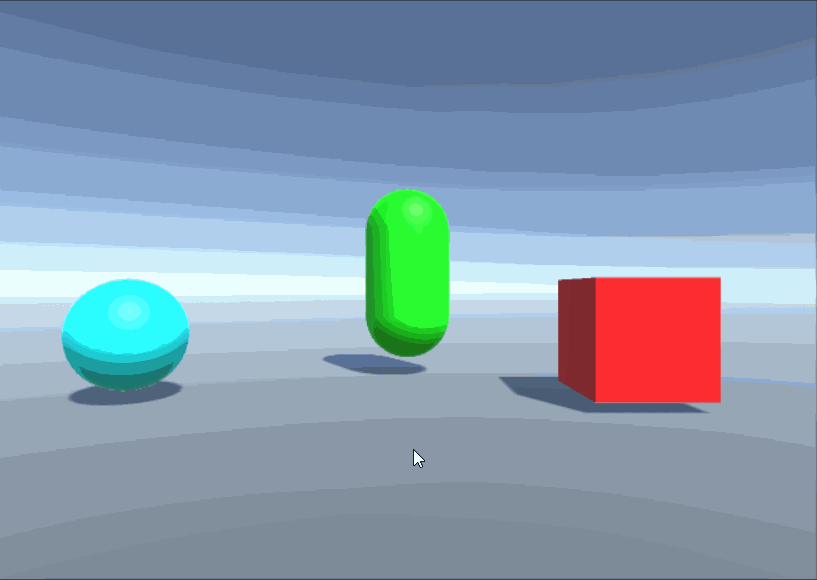
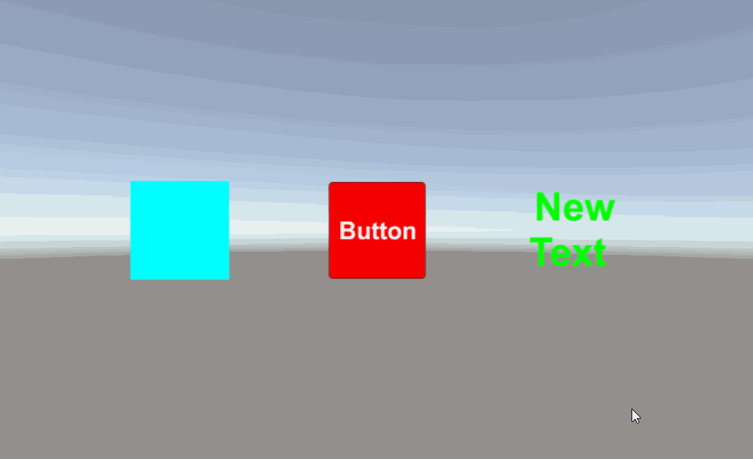

# MGS-Tooltip
- [中文手册](./README_ZH.md)

## Summary
- Unity plugin for make Tooltip of gameobject or UGUI in scene.

## Demand
- Show Tooltip on mouse pointer enter the gameobject or UGUI in Unity scene.

## Environment
- Unity 5.3 or above.
- .Net Framework 3.5 or above.

## Achieve
- TooltipForm: Base class for tooltip form.
- TextTooltipForm: Tooltip form to show text content.
- TooltipTrigger: Base class for tooltip trrigger.
- TooltipTriggerOnCollider: Tooltip trrigger base on collider.
- TooltipTriggerOnUGUI: Tooltip trrigger base on UGUI.

## Demo
- Prefabs in the path "Resources/UIForm/Prefabs/Tooltip" provide reference to you.
- Demos in the path "MGS-Tooltip/Scenes" provide reference to you.

## Preview
- Tooltip On Collider

- Tooltip On UGUI

## Contact
- If you have any questions, feel free to contact me at mogoson@outlook.com.
