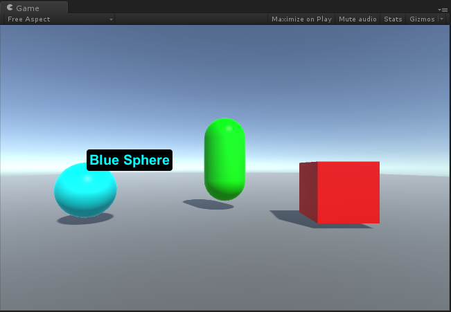

# MGS-Tooltip
- [中文手册](./README_ZH.md)

## Summary
- Unity plugin for make Tooltip of gameobject in scene.

## Demand
- Show Tooltip on mouse pointer enter the gameobject in Unity scene.

## Environment
- Unity 5.0 or above.
- .Net Framework 3.0 or above.

## Scheme
- Use UGUI to make Tooltip UI.
- Write UI control code, update UI text and adapt to the mouse pointer position and screen edge.
- Write UI trigger code, control UI Show/Close.

## Achieve
- TooltipUI：Control the Tooltip UI.
- TooltipTrigger：Trigger the Tooltip UI.

## Demo
- Prefabs in the path "MGS-Tooltip/Prefabs" provide reference to you.
- Demos in the path "MGS-Tooltip/Scenes" provide reference to you.

## Preview
- SphereTooltip

## Contact
- If you have any questions, fell free to contact me at mogoson@qq.com.